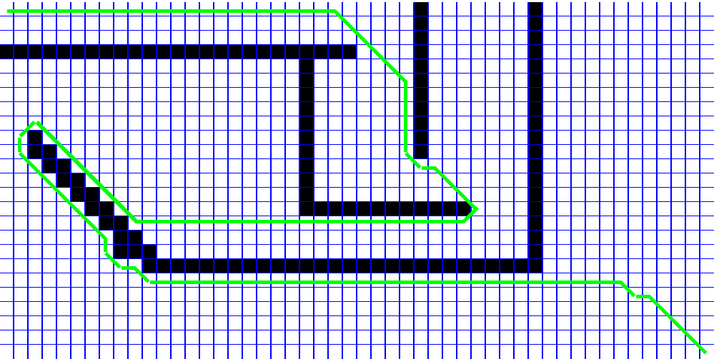
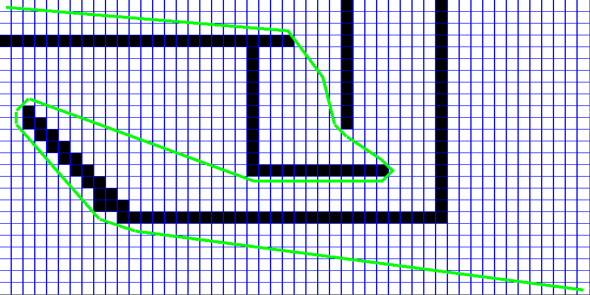

# Implementation and visualisation of A* and Theta* pathfinding algorithms
I used 2 heuristics: euclidean and manhattan.

Start point -> top left corner

Destination -> bottom right corner

# Images
1. A*, manhattan heuristic

2. Theta*, euclidean heuristic

